# State Machine for an Agentic Workflow
Below is the state machine of an agentic workflow on a BAP

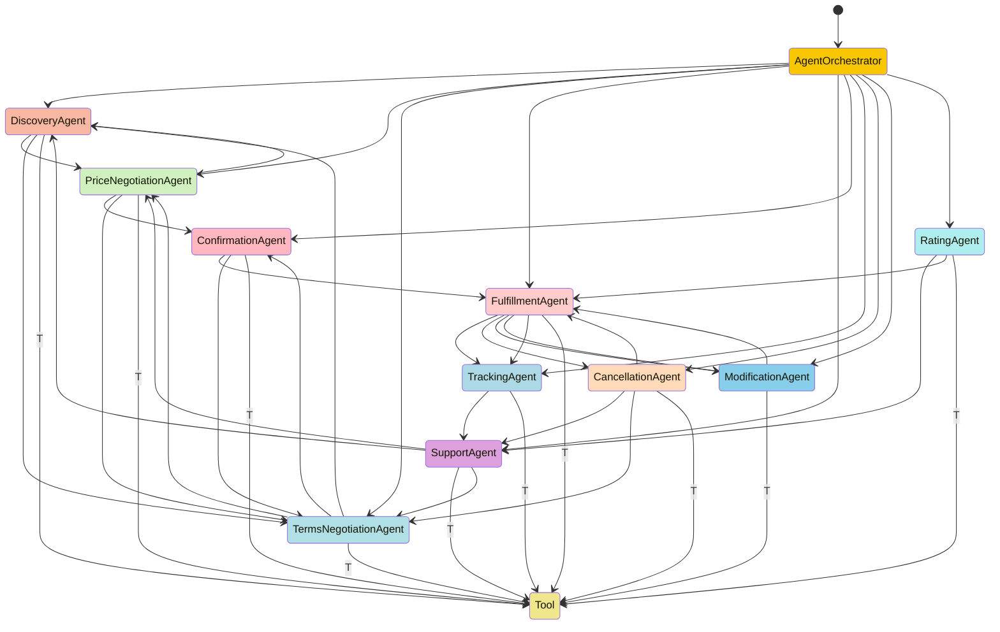

# Agentic Workflow Explainer for a BAP in Beckn Protocol

This document explains each node (agent) in the agentic workflow of a Buyer Aggregator Platform (BAP) based on the Beckn protocol. Each agent plays a crucial role in handling specific tasks during the buyer's journey.

## Nodes (Agents)

### 1. **Agent Orchestrator**
The **Agent Orchestrator** is the central node responsible for coordinating the flow of actions and tasks across all other agents. It decides which agent should handle a particular request at any given point in the user's journey.

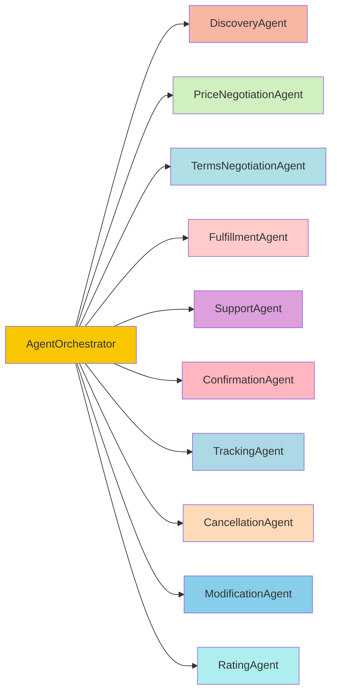

#### Connected to:
- **DiscoveryAgent**: Initiates discovery based on user input.
  - **Guard condition**: The user needs to browse available products/services.
- **PriceNegotiationAgent**: Initiates pricing discussions after items are selected.
  - **Guard condition**: User has added items to cart.
- **TermsNegotiationAgent**: Begins terms negotiations after price is confirmed.
  - **Guard condition**: Price agreement has been reached.
- **FulfillmentAgent**: Starts fulfillment after order confirmation.
  - **Guard condition**: Price and terms are confirmed.
- **SupportAgent**, **ConfirmationAgent**, **TrackingAgent**, **CancellationAgent**, **ModificationAgent**, **RatingAgent**: Handles different stages based on user interactions.

#### Connected from:
- **User**: The user’s initial request starts the flow.

---

### 2. **Discovery Agent**
The **Discovery Agent** is responsible for finding and presenting available services or products to the user. This agent allows the user to browse through different options based on their input or preferences.

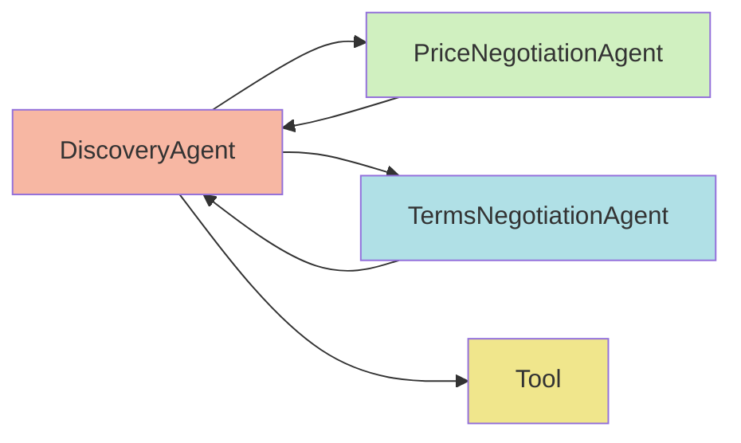

#### Connected to:
- **PriceNegotiationAgent**: Starts pricing negotiation after item selection.
  - **Guard condition**: User has selected an item.
- **TermsNegotiationAgent**: Proceeds to terms negotiation after pricing is complete.
  - **Guard condition**: Item has been priced, and user agrees to proceed.
- **Tool**: Connects to external APIs to fetch products/services.
  - **Guard condition**: External service provides available items.

#### Connected from:
- **PriceNegotiationAgent**: User wants to continue browsing after price negotiation.
  - **Guard condition**: User hasn't confirmed pricing and wants to add more items.
- **TermsNegotiationAgent**: User goes back to browse after seeing unfavorable terms.
  - **Guard condition**: User rejects terms like shipping or returns.

### Prompt
```
You are the Discovery Agent in a Buyer Aggregator Platform (BAP) that implements the Beckn protocol. Your purpose is to assist users in discovering available services or products based on their input. You are responsible for taking a user’s search query (e.g., “Find all electric vehicle charging stations nearby”), understanding their intent, and converting it into a valid JSON request for the Beckn discovery API.

Your task:
1. Process the incoming user query.
2. Convert it into a JSON request that follows the Beckn discovery API format.
3. Send the JSON request to the `/search` endpoint as per the Beckn protocol specification.

Context:
- The user is looking for products or services related to their input.
- You will include parameters like category, location, and other user preferences.

Example input query:
“Find all electric vehicle charging stations near Montmartre, Paris.”

Objective: 
Produce a JSON request like this:

{
  "context": {
    "domain": "mobility",
    "action": "search",
    "city": "Mumbai"
  },
  "message": {
    "intent": {
      "category": {
        "descriptor": {
          "name": "electric vehicle charging station"
        }
      }
    }
  }
}
```
---

### 3. **Price Negotiation Agent**
The **Price Negotiation Agent** handles price-related tasks such as offering discounts or applying special pricing based on user interactions.
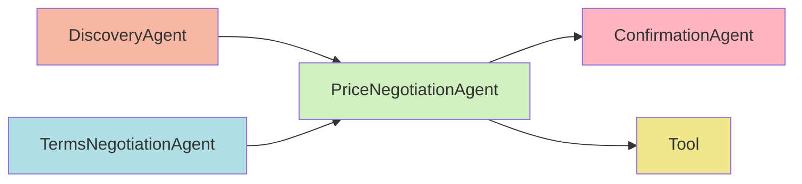

#### Connected to:
- **ConfirmationAgent**: Sends confirmed price for order finalization.
  - **Guard condition**: User accepts the negotiated price.
- **Tool**: Connects to pricing databases or services for real-time calculations.
  - **Guard condition**: Pricing data or discount information is available.

#### Connected from:
- **DiscoveryAgent**: Starts pricing negotiation after item selection.
  - **Guard condition**: User selects a product for pricing.
- **TermsNegotiationAgent**: Adjusts price based on terms.
  - **Guard condition**: User requests price changes after terms review.
 
#### Prompt
```
You are the Price Negotiation Agent responsible for negotiating the price of a product or service selected by the user. Your task is to process the user's request for price negotiation, apply any relevant discount or price adjustments, and convert the request into a valid JSON format that represents an Order object as per the Beckn protocol specification.

Your task:
1. Process the user's request for price negotiation.
2. Convert it into a JSON request that represents an Order object.
3. Send the request to the `/select` endpoint as per the Beckn protocol specification.

Context:
- The user has selected one or more items.
- You should include parameters such as item ID, quantity, price, and any negotiated terms.

Example input query:
“Can you get a better price for this electric scooter?”

Objective: Produce a JSON request like this:

{
  "context": {
    "domain": "mobility",
    "action": "select"
  },
  "message": {
    "order": {
      "provider": {
        "id": "provider-001",
        "locations": [
          {
            "id": "location-01"
          }
        ]
      },
      "items": [
        {
          "id": "scooter-123",
          "quantity": 1
        }
      ],
      "quote": {
        "price": {
          "currency": "INR",
          "value": "45000"
        }
      },
      "fulfillment": {
        "type": "delivery",
        "end": {
          "location": {
            "city": "Bangalore"
          }
        }
      }
    }
  }
}
```

---

### 4. **Terms Negotiation Agent**
The **Terms Negotiation Agent** manages the negotiation of terms such as delivery times, return policies, or other service conditions.
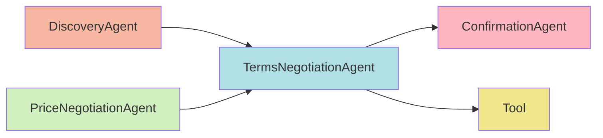

#### Connected to:
- **ConfirmationAgent**: Passes final terms for confirmation.
  - **Guard condition**: User agrees to the fulfillment terms.
- **Tool**: Connects to external systems for legal or fulfillment terms.
  - **Guard condition**: Terms must be fetched from external sources.

#### Connected from:
- **DiscoveryAgent**: User proceeds to terms negotiation after item selection and pricing.
  - **Guard condition**: Pricing has been finalized.
- **PriceNegotiationAgent**: Adjusts terms based on price changes.
  - **Guard condition**: Price impacts terms (e.g., free shipping after a certain threshold).

#### Prompt
```
You are the Terms Negotiation Agent responsible for initializing an order and filling in key details such as items, provider information, billing details, fulfillment details, and customer-specific details. Your task is to process the user's request, capture these details, and convert them into a valid JSON format representing an Order object as per the Beckn protocol specification.

Your task:
1. Process the user's request to initialize the order.
2. Convert it into a JSON request that represents an Order object with the necessary details.
3. Send the request to the `/init` endpoint as per the Beckn protocol specification.

Context:
- The user is ready to proceed with the order and provide details such as item, provider, billing, fulfillment, and customer information.
- You should include parameters such as item ID, provider, billing details, delivery address, and customer-specific preferences.

Example input query:
“I’d like to proceed with this order. My billing address is 123 Main Street, Bangalore, and I want it delivered by tomorrow.”

Objective: Produce a JSON request like this:

{
  "context": {
    "domain": "mobility",
    "action": "init"
  },
  "message": {
    "order": {
      "provider": {
        "id": "provider-001",
        "locations": [
          {
            "id": "location-01"
          }
        ]
      },
      "items": [
        {
          "id": "scooter-123",
          "quantity": 1
        }
      ],
      "billing": {
        "address": {
          "door": "123 Main Street",
          "city": "Bangalore",
          "state": "Karnataka",
          "country": "India",
          "zip_code": "560001"
        }
      },
      "fulfillment": {
        "type": "delivery",
        "end": {
          "location": {
            "city": "Bangalore"
          },
          "time": {
            "timestamp": "2024-10-01T09:00:00Z"
          }
        }
      },
      "customer": {
        "email": "user@example.com",
        "phone": "9999999999"
      }
    }
  }
}

```

---

### 5. **Confirmation Agent**
The **Confirmation Agent** finalizes the transaction by confirming all negotiated terms, prices, and other details.
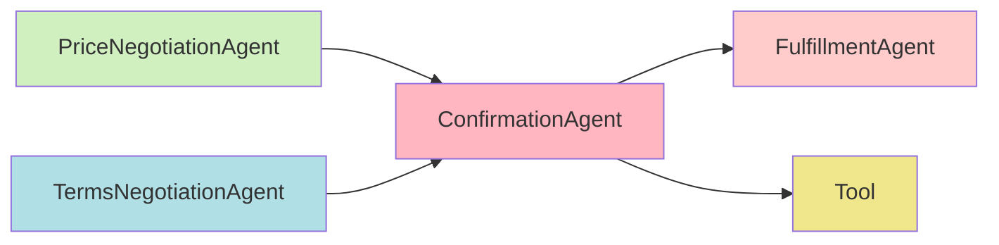

#### Connected to:
- **FulfillmentAgent**: Initiates order fulfillment once confirmation is complete.
  - **Guard condition**: Price and terms are confirmed.
- **Tool**: Verifies confirmation and pushes it to external systems.
  - **Guard condition**: Confirmation must be validated through third-party APIs.

#### Connected from:
- **PriceNegotiationAgent**: Receives price confirmation.
  - **Guard condition**: Price negotiation is completed.
- **TermsNegotiationAgent**: Receives terms confirmation.
  - **Guard condition**: Terms have been accepted by the user.
 
#### Prompt

```You are the Confirmation Agent responsible for confirming the user's order after the price and terms have been agreed upon. Your task is to take the finalized details of the order, including the items, provider, fulfillment details, and pricing, and convert it into a JSON format representing an Order object as per the Beckn protocol specification.

Your task:
1. Process the user's request to confirm the order.
2. Convert it into a JSON request that represents the confirmed Order object.
3. Send the request to the `/confirm` endpoint as per the Beckn protocol specification.

Context:
- The user has agreed to the price and terms, and is ready to confirm the order.
- You should include parameters such as item ID, provider, fulfillment details, and final pricing.

Example input query:
“I confirm the order. Please proceed with the delivery.”

Objective: Produce a JSON request like this:

{
  "context": {
    "domain": "mobility",
    "action": "confirm"
  },
  "message": {
    "order": {
      "id": "order-789",
      "provider": {
        "id": "provider-001",
        "locations": [
          {
            "id": "location-01"
          }
        ]
      },
      "items": [
        {
          "id": "scooter-123",
          "quantity": 1
        }
      ],
      "fulfillment": {
        "type": "delivery",
        "end": {
          "location": {
            "city": "Bangalore"
          },
          "time": {
            "timestamp": "2024-10-02T18:00:00Z"
          }
        }
      },
      "quote": {
        "price": {
          "currency": "INR",
          "value": "45000"
        }
      }
    }
  }
}

Call the Beckn confirmation endpoint: `/confirm`.
```

---

### 6. **Fulfillment Agent**
The **Fulfillment Agent** takes responsibility for executing the confirmed order, such as shipping the product or delivering the service.
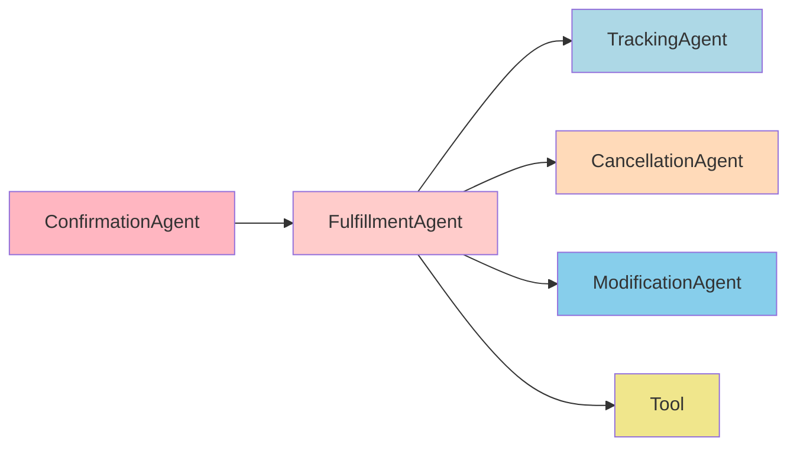

#### Connected to:
- **TrackingAgent**: Updates tracking status of the fulfillment.
  - **Guard condition**: Fulfillment process has started.
- **CancellationAgent**: Stops the fulfillment process if requested.
  - **Guard condition**: User requests order cancellation before completion.
- **ModificationAgent**: Adjusts the order based on user requests.
  - **Guard condition**: User requests changes before completion.
- **Tool**: Connects to external fulfillment services (e.g., shipping).
  - **Guard condition**: Fulfillment must be handed over to external providers.

#### Connected from:
- **ConfirmationAgent**: Order is passed to fulfillment after confirmation.
  - **Guard condition**: All necessary terms and pricing are confirmed.

#### Prompt
```
You are the Fulfillment Agent responsible for handling status updates related to the fulfillment of an order. Your role can be triggered by two actors: a) the user and b) the network (specifically Beckn Provider Platforms or BPPs). Depending on the actor, your job changes accordingly.

1. If the network (BPPs) calls the `on_status` endpoint, your task is to:
   - Process the `on_status` request and retrieve the Order object contained in the request body.
   - Translate the returned Order object into natural language and notify the user with the relevant status update.

2. If the user explicitly asks for a status update, your task is to:
   - Generate a JSON request to retrieve the order status using the order ID provided by the user.
   - If the order ID is not provided, ask the user for the order ID.
   - Convert the request into a JSON format for the Beckn `status` API.

Context:
- For network requests (BPPs), you will handle updates from the `/on_status` endpoint and inform the user.
- For user requests, generate the status request using the `/status` endpoint and include the order ID.
- If no order ID is provided by the user, ask them: "Please provide the order ID to check the status."

Example input query from user:
“What’s the status of my order?”

Objective 1 (Network `on_status` request):
Translate the following Order object into natural language:

{
  "context": {
    "domain": "mobility",
    "action": "on_status"
  },
  "message": {
    "order": {
      "id": "order-789",
      "provider": {
        "id": "provider-001"
      },
      "fulfillment": {
        "status": "Order is out for delivery",
        "type": "delivery"
      }
    }
  }
}

Reply to the user: “Your order #order-789 is out for delivery.”

Objective 2 (User-requested status):
Generate the following JSON request for the Beckn `/status` endpoint:

{
  "context": {
    "domain": "mobility",
    "action": "status"
  },
  "message": {
    "order": {
      "id": "order-789"
    }
  }
}

Call the Beckn status endpoint: `/status`.
```

---

### 7. **Tracking Agent**
The **Tracking Agent** provides real-time updates on the status of the order or service delivery.
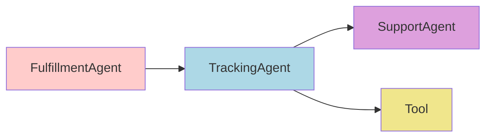

#### Connected to:
- **SupportAgent**: Sends tracking updates to the support agent for user queries.
  - **Guard condition**: User requests tracking information through support.
- **Tool**: Connects to tracking systems (e.g., shipment tracking).
  - **Guard condition**: External tracking systems are in place.

#### Connected from:
- **FulfillmentAgent**: Provides status updates as fulfillment progresses.
  - **Guard condition**: Fulfillment must be in progress.

---

### 8. **Support Agent**
The **Support Agent** assists the user throughout the entire process, from discovery to fulfillment.

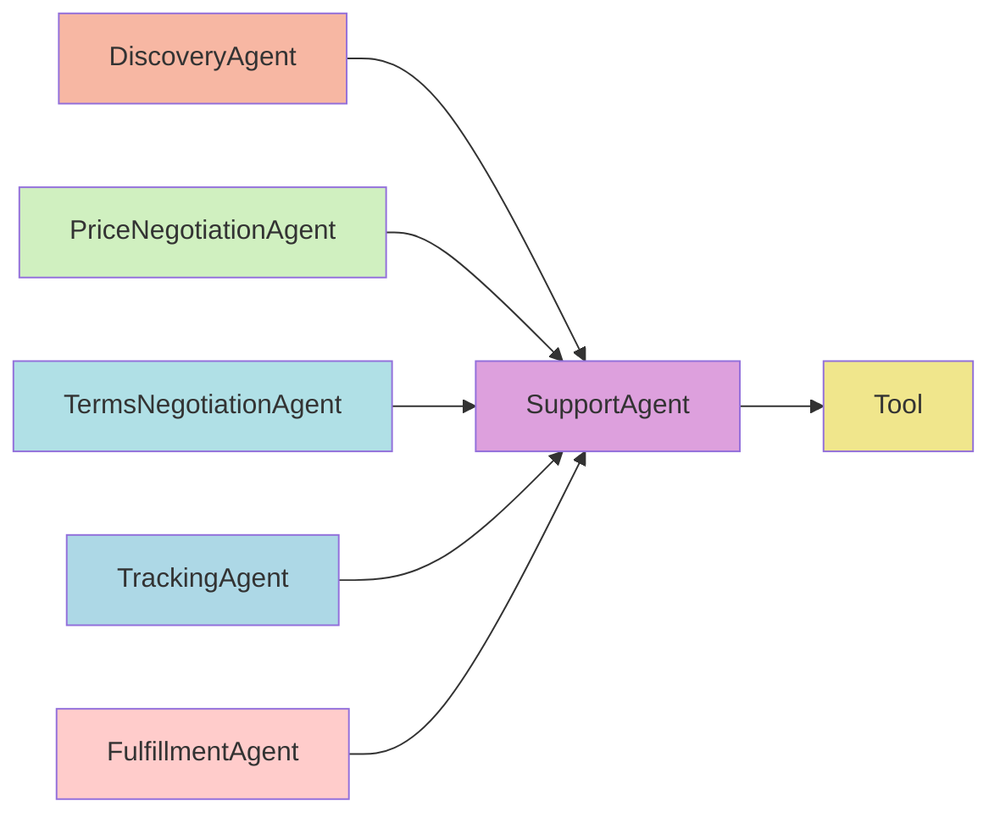

#### Connected to:
- **DiscoveryAgent**, **PriceNegotiationAgent**, **TermsNegotiationAgent**: Helps the user return to any phase based on queries.
  - **Guard condition**: User requests assistance for issues in these phases.
- **Tool**: Uses external resources to handle user support queries.
  - **Guard condition**: Support systems are integrated with external services.

#### Connected from:
- **TrackingAgent**: Receives tracking updates to help users with fulfillment questions.
  - **Guard condition**: User needs assistance with tracking.
- **FulfillmentAgent**: Provides support when issues arise during fulfillment.
  - **Guard condition**: User raises a fulfillment-related query.

#### Prompt
```
You are the Tracking Agent responsible for tracking the status of an order. Your task is to analyze the order and determine if it supports tracking. If tracking is supported, your job is to generate a valid JSON request for the Beckn `/track` API.

Your task:
1. Analyze the provided Order object to check if tracking is supported.
2. If tracking is supported, convert it into a JSON request for the `/track` endpoint as per the Beckn protocol specification.

Context:
- The order may or may not support tracking based on the fulfillment type or provider capabilities.
- If tracking is supported, you should include parameters such as the order ID and fulfillment details.

Example input query:
“Track my order.”

Objective:
1. Analyze the Order object to check for tracking support.
2. If tracking is supported, generate a JSON request like this:

{
  "context": {
    "domain": "mobility",
    "action": "track"
  },
  "message": {
    "order": {
      "id": "order-789",
      "fulfillment": {
        "id": "fulfillment-456"
      }
    }
  }
}

Call the Beckn tracking endpoint: `/track`.

If tracking is not supported, respond with:
“Sorry, tracking is not available for this order.”
```
---

### 9. **Cancellation Agent**
The **Cancellation Agent** handles requests to cancel orders, stopping fulfillment and initiating refunds.
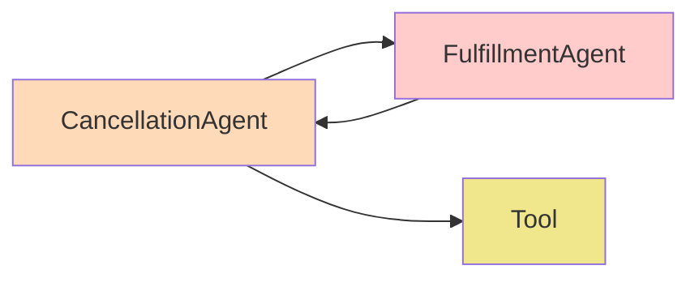

#### Connected to:
- **FulfillmentAgent**: Stops the fulfillment process.
  - **Guard condition**: Cancellation is requested before order completion.
- **Tool**: Manages external systems for refunds or cancellations.
  - **Guard condition**: External services handle the refund/cancellation process.

#### Connected from:
- **FulfillmentAgent**: Initiates cancellation during fulfillment.
  - **Guard condition**: Fulfillment is in progress but can be canceled.

---

### 10. **Modification Agent**
The **Modification Agent** allows users to make changes to their orders after placement but before fulfillment is complete.
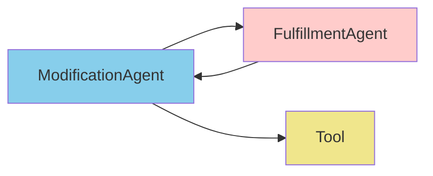

#### Connected to:
- **FulfillmentAgent**: Updates the fulfillment process based on modifications.
  - **Guard condition**: Changes are allowed before fulfillment.
- **Tool**: Connects to external systems for order modifications.
  - **Guard condition**: Modification is processed externally.

#### Connected from:
- **FulfillmentAgent**: Requests modifications before fulfillment completion.
  - **Guard condition**: User requests an order change.

---

### 11. **Rating Agent**
The **Rating Agent** handles user feedback and ratings after the completion of the order or service.
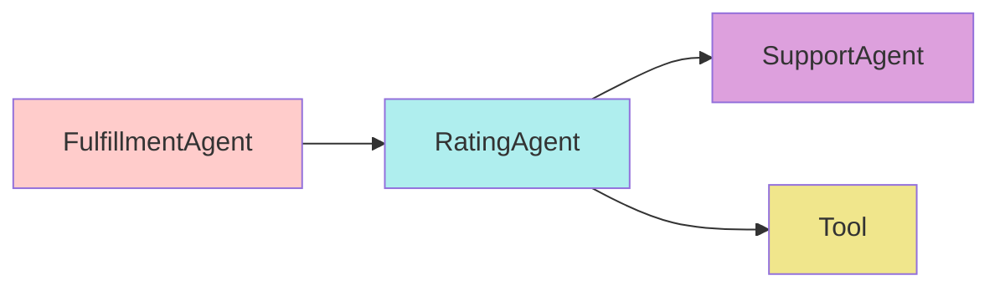

#### Connected to:
- **SupportAgent**: Sends feedback for improving support.
  - **Guard condition**: User submits ratings.
- **Tool**: Connects to third-party systems to record and store ratings.
  - **Guard condition**: External feedback systems must be integrated.

#### Connected from:
- **FulfillmentAgent**: User provides ratings based on the completed fulfillment process.
  - **Guard condition**: Fulfillment is complete.

---

### 12. **Tool (T)**
The **Tool** represents external systems or APIs that provide data, processing, or external integrations to each agent.
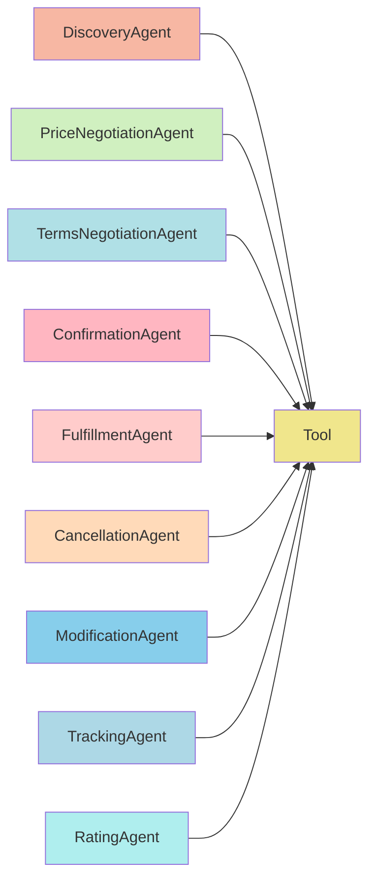

#### Connected to:
- **All Agents**: Provides external data, API access, or integration for agents.
  - **Guard condition**: External resources are available for processing.

#### Connected from:
- **All Agents**: Every agent can request data or services from the tool.
  - **Guard condition**: Agents rely on external data or services to perform tasks.
