# State Machine for an Agentic Workflow
Below is the state machine of an agentic workflow on a BAP

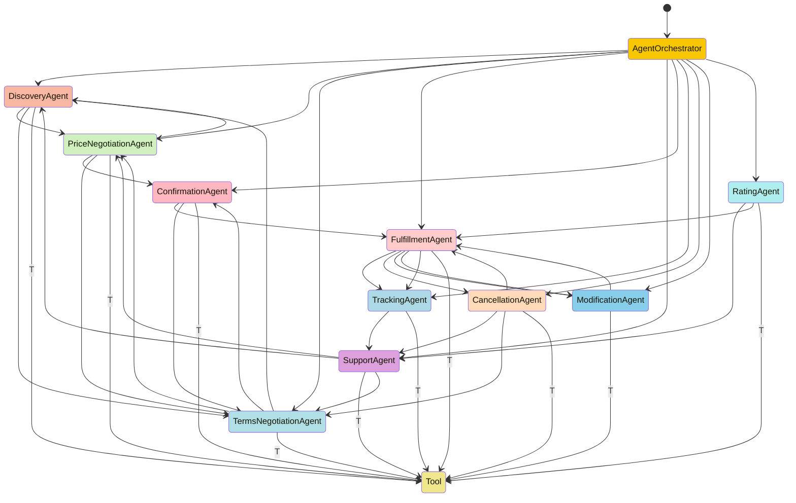

# Agentic Workflow Explainer for a BAP in Beckn Protocol

This document explains each node (agent) in the agentic workflow of a Buyer Aggregator Platform (BAP) based on the Beckn protocol. Each agent plays a crucial role in handling specific tasks during the buyer's journey.

## Nodes (Agents)

### 1. **Agent Orchestrator**
The **Agent Orchestrator** is the central node responsible for coordinating the flow of actions and tasks across all other agents. It decides which agent should handle a particular request at any given point in the user's journey.

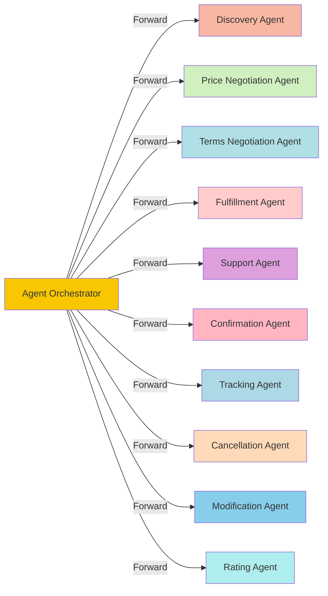

#### Connected to:
- **DiscoveryAgent**: Initiates discovery based on user input.
  - **Guard condition**: The user needs to browse available products/services.
- **PriceNegotiationAgent**: Initiates pricing discussions after items are selected.
  - **Guard condition**: User has added items to cart.
- **TermsNegotiationAgent**: Begins terms negotiations after price is confirmed.
  - **Guard condition**: Price agreement has been reached.
- **FulfillmentAgent**: Starts fulfillment after order confirmation.
  - **Guard condition**: Price and terms are confirmed.
- **SupportAgent**, **ConfirmationAgent**, **TrackingAgent**, **CancellationAgent**, **ModificationAgent**, **RatingAgent**: Handles different stages based on user interactions.

#### Connected from:
- **User**: The user’s initial request starts the flow.

---

### 2. **Discovery Agent**
The **Discovery Agent** is responsible for finding and presenting available services or products to the user. This agent allows the user to browse through different options based on their input or preferences.

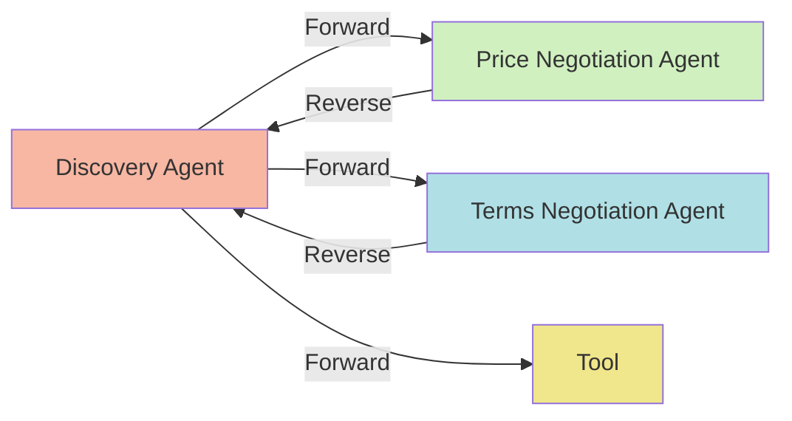

#### Connected to:
- **PriceNegotiationAgent**: Starts pricing negotiation after item selection.
  - **Guard condition**: User has selected an item.
- **TermsNegotiationAgent**: Proceeds to terms negotiation after pricing is complete.
  - **Guard condition**: Item has been priced, and user agrees to proceed.
- **Tool**: Connects to external APIs to fetch products/services.
  - **Guard condition**: External service provides available items.

#### Connected from:
- **PriceNegotiationAgent**: User wants to continue browsing after price negotiation.
  - **Guard condition**: User hasn't confirmed pricing and wants to add more items.
- **TermsNegotiationAgent**: User goes back to browse after seeing unfavorable terms.
  - **Guard condition**: User rejects terms like shipping or returns.

---

### 3. **Price Negotiation Agent**
The **Price Negotiation Agent** handles price-related tasks such as offering discounts or applying special pricing based on user interactions.
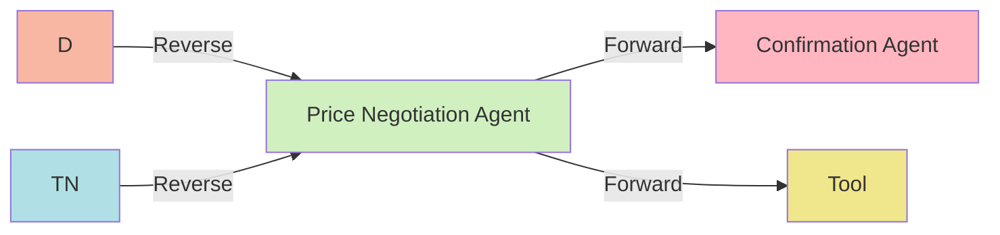

#### Connected to:
- **ConfirmationAgent**: Sends confirmed price for order finalization.
  - **Guard condition**: User accepts the negotiated price.
- **Tool**: Connects to pricing databases or services for real-time calculations.
  - **Guard condition**: Pricing data or discount information is available.

#### Connected from:
- **DiscoveryAgent**: Starts pricing negotiation after item selection.
  - **Guard condition**: User selects a product for pricing.
- **TermsNegotiationAgent**: Adjusts price based on terms.
  - **Guard condition**: User requests price changes after terms review.

---

### 4. **Terms Negotiation Agent**
The **Terms Negotiation Agent** manages the negotiation of terms such as delivery times, return policies, or other service conditions.
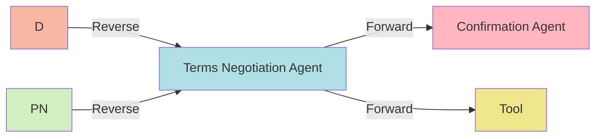

#### Connected to:
- **ConfirmationAgent**: Passes final terms for confirmation.
  - **Guard condition**: User agrees to the fulfillment terms.
- **Tool**: Connects to external systems for legal or fulfillment terms.
  - **Guard condition**: Terms must be fetched from external sources.

#### Connected from:
- **DiscoveryAgent**: User proceeds to terms negotiation after item selection and pricing.
  - **Guard condition**: Pricing has been finalized.
- **PriceNegotiationAgent**: Adjusts terms based on price changes.
  - **Guard condition**: Price impacts terms (e.g., free shipping after a certain threshold).

---

### 5. **Confirmation Agent**
The **Confirmation Agent** finalizes the transaction by confirming all negotiated terms, prices, and other details.
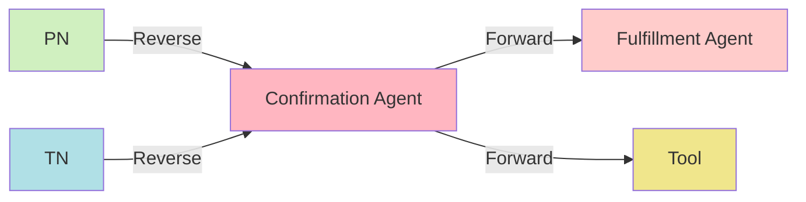

#### Connected to:
- **FulfillmentAgent**: Initiates order fulfillment once confirmation is complete.
  - **Guard condition**: Price and terms are confirmed.
- **Tool**: Verifies confirmation and pushes it to external systems.
  - **Guard condition**: Confirmation must be validated through third-party APIs.

#### Connected from:
- **PriceNegotiationAgent**: Receives price confirmation.
  - **Guard condition**: Price negotiation is completed.
- **TermsNegotiationAgent**: Receives terms confirmation.
  - **Guard condition**: Terms have been accepted by the user.

---

### 6. **Fulfillment Agent**
The **Fulfillment Agent** takes responsibility for executing the confirmed order, such as shipping the product or delivering the service.
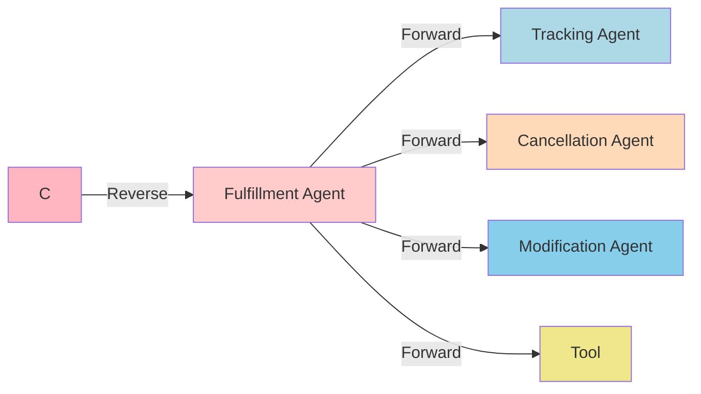

#### Connected to:
- **TrackingAgent**: Updates tracking status of the fulfillment.
  - **Guard condition**: Fulfillment process has started.
- **CancellationAgent**: Stops the fulfillment process if requested.
  - **Guard condition**: User requests order cancellation before completion.
- **ModificationAgent**: Adjusts the order based on user requests.
  - **Guard condition**: User requests changes before completion.
- **Tool**: Connects to external fulfillment services (e.g., shipping).
  - **Guard condition**: Fulfillment must be handed over to external providers.

#### Connected from:
- **ConfirmationAgent**: Order is passed to fulfillment after confirmation.
  - **Guard condition**: All necessary terms and pricing are confirmed.

---

### 7. **Tracking Agent**
The **Tracking Agent** provides real-time updates on the status of the order or service delivery.
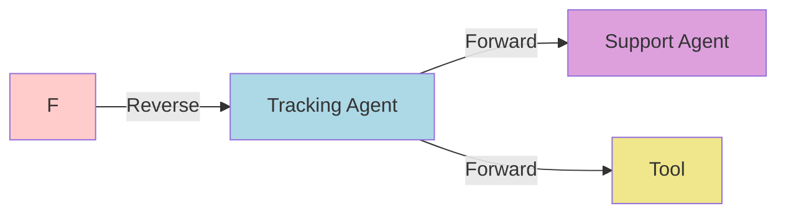

#### Connected to:
- **SupportAgent**: Sends tracking updates to the support agent for user queries.
  - **Guard condition**: User requests tracking information through support.
- **Tool**: Connects to tracking systems (e.g., shipment tracking).
  - **Guard condition**: External tracking systems are in place.

#### Connected from:
- **FulfillmentAgent**: Provides status updates as fulfillment progresses.
  - **Guard condition**: Fulfillment must be in progress.

---

### 8. **Support Agent**
The **Support Agent** assists the user throughout the entire process, from discovery to fulfillment.

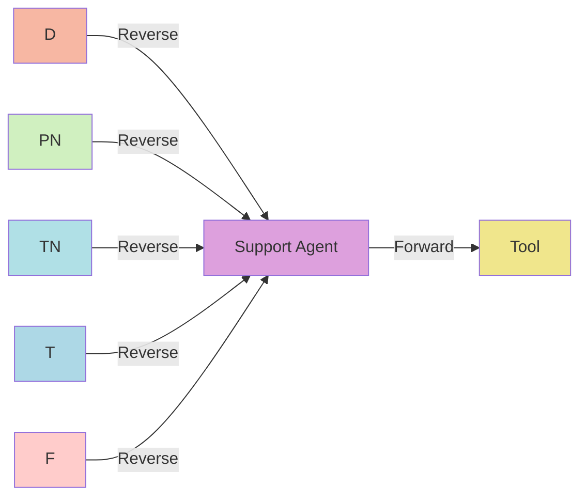

#### Connected to:
- **DiscoveryAgent**, **PriceNegotiationAgent**, **TermsNegotiationAgent**: Helps the user return to any phase based on queries.
  - **Guard condition**: User requests assistance for issues in these phases.
- **Tool**: Uses external resources to handle user support queries.
  - **Guard condition**: Support systems are integrated with external services.

#### Connected from:
- **TrackingAgent**: Receives tracking updates to help users with fulfillment questions.
  - **Guard condition**: User needs assistance with tracking.
- **FulfillmentAgent**: Provides support when issues arise during fulfillment.
  - **Guard condition**: User raises a fulfillment-related query.

---

### 9. **Cancellation Agent**
The **Cancellation Agent** handles requests to cancel orders, stopping fulfillment and initiating refunds.
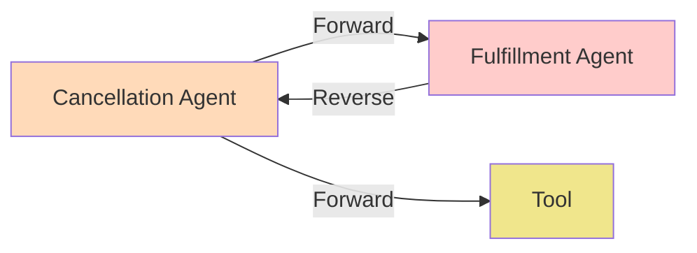

#### Connected to:
- **FulfillmentAgent**: Stops the fulfillment process.
  - **Guard condition**: Cancellation is requested before order completion.
- **Tool**: Manages external systems for refunds or cancellations.
  - **Guard condition**: External services handle the refund/cancellation process.

#### Connected from:
- **FulfillmentAgent**: Initiates cancellation during fulfillment.
  - **Guard condition**: Fulfillment is in progress but can be canceled.

---

### 10. **Modification Agent**
The **Modification Agent** allows users to make changes to their orders after placement but before fulfillment is complete.
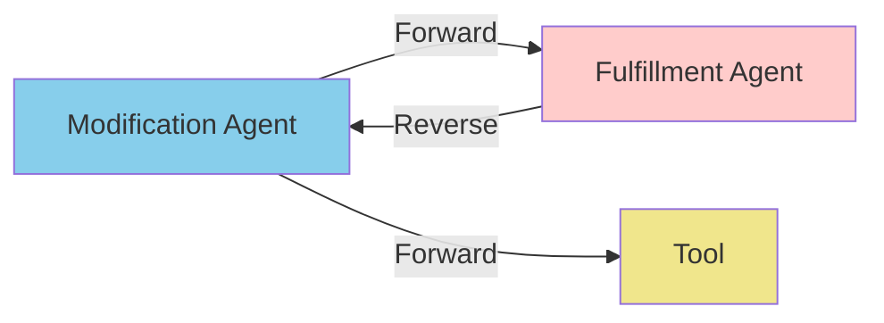

#### Connected to:
- **FulfillmentAgent**: Updates the fulfillment process based on modifications.
  - **Guard condition**: Changes are allowed before fulfillment.
- **Tool**: Connects to external systems for order modifications.
  - **Guard condition**: Modification is processed externally.

#### Connected from:
- **FulfillmentAgent**: Requests modifications before fulfillment completion.
  - **Guard condition**: User requests an order change.

---

### 11. **Rating Agent**
The **Rating Agent** handles user feedback and ratings after the completion of the order or service.
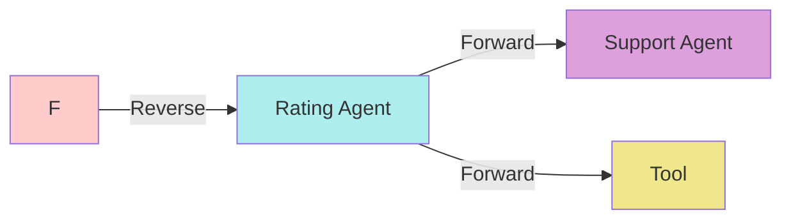

#### Connected to:
- **SupportAgent**: Sends feedback for improving support.
  - **Guard condition**: User submits ratings.
- **Tool**: Connects to third-party systems to record and store ratings.
  - **Guard condition**: External feedback systems must be integrated.

#### Connected from:
- **FulfillmentAgent**: User provides ratings based on the completed fulfillment process.
  - **Guard condition**: Fulfillment is complete.

---

### 12. **Tool (T)**
The **Tool** represents external systems or APIs that provide data, processing, or external integrations to each agent.
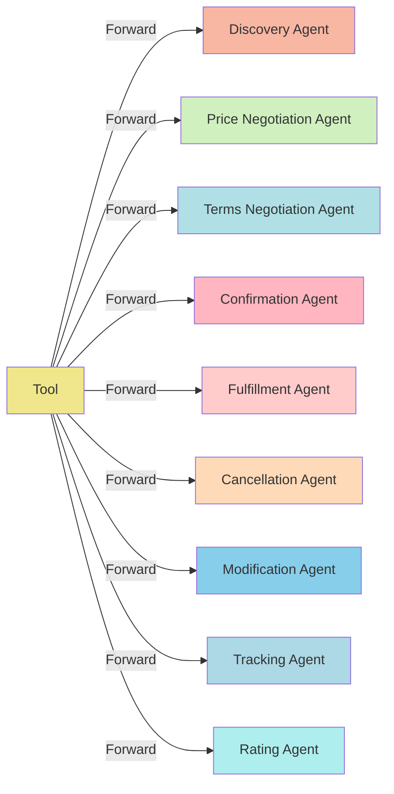

#### Connected to:
- **All Agents**: Provides external data, API access, or integration for agents.
  - **Guard condition**: External resources are available for processing.

#### Connected from:
- **All Agents**: Every agent can request data or services from the tool.
  - **Guard condition**: Agents rely on external data or services to perform tasks.
